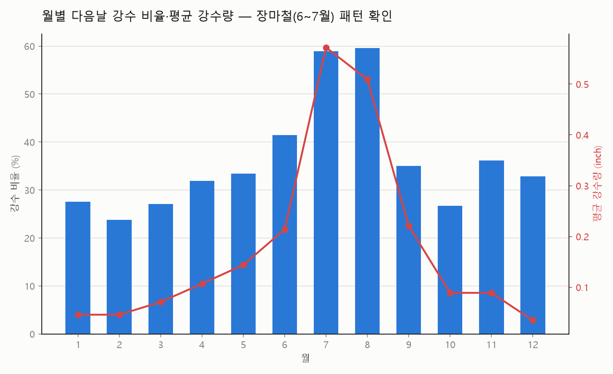
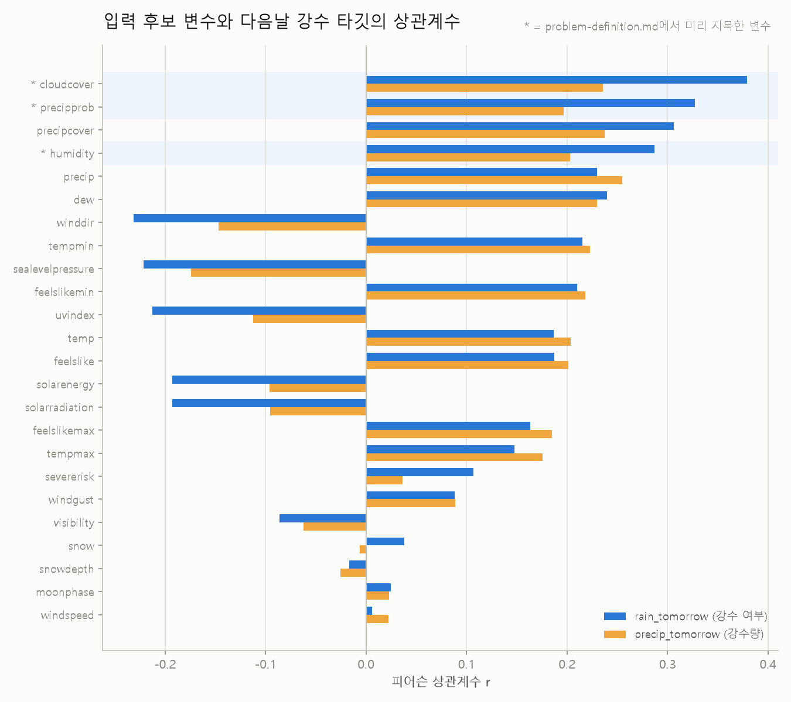
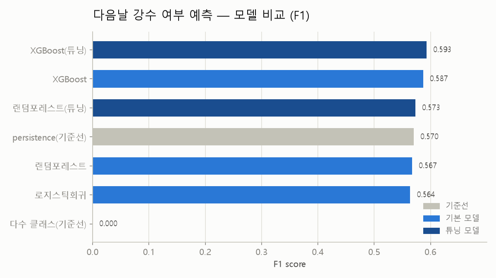
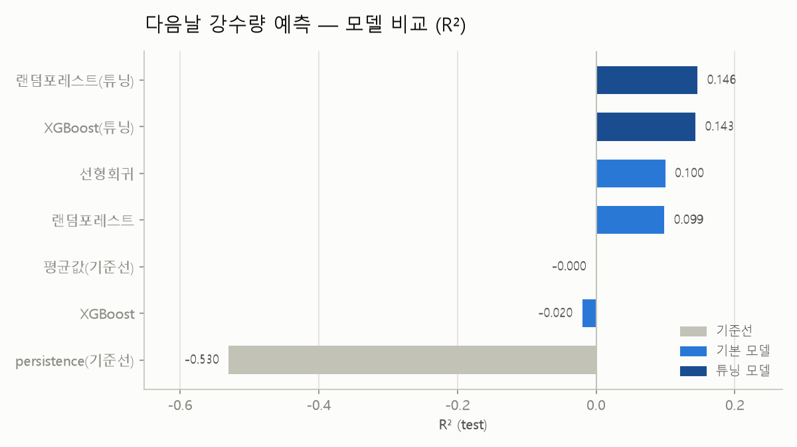
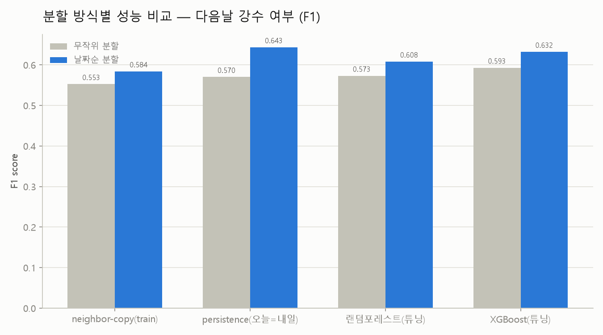
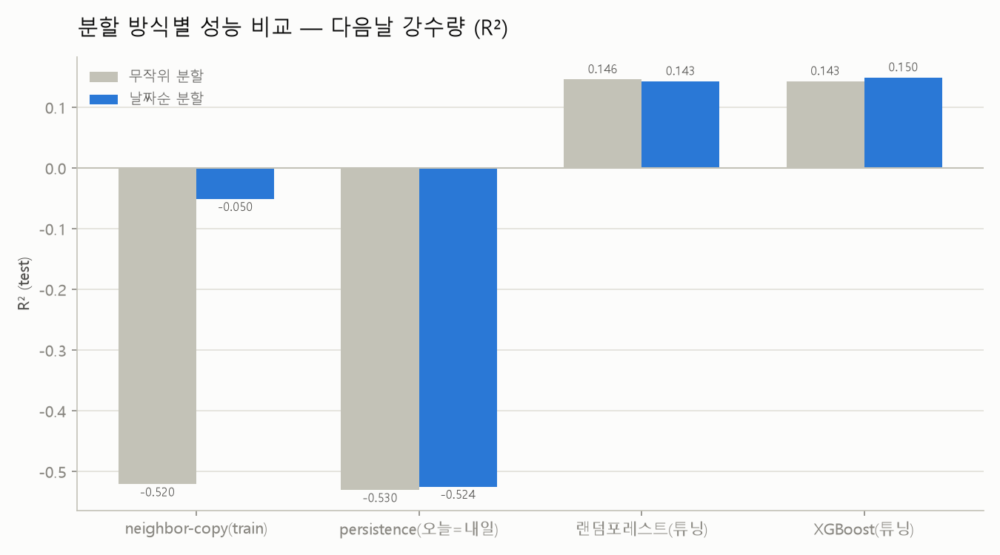

# ☔ 서울 다음날 강수 예측

서울 일별 기상 관측(1994-01-01 \~ 2024-01-01, 30년치, 10,958행)을 가지고 **내일 비가
올지**(분류), **온다면 얼마나 올지**(회귀)를 예측했다. 오늘(t)까지의 날씨로 내일(t+1)을
맞추는 문제라 입력에 t+1일자 값을 절대 넣지 않도록 관리했다.

전체 작업은 [Claude Code](https://claude.com/product/claude-code)와의 대화로 진행했다.
분석 세부 내용은 [`REPORT.md`](./REPORT.md)에, 계획 단계 기록은
[`docs/CLAUDE_CODE_WORKFLOW.md`](./docs/CLAUDE_CODE_WORKFLOW.md)에 있다.

## 모델 비교

같은 입력 변수 19개(결측 50%+ 컬럼 제외)와 같은 8:2 분할(`random_state=42`)로 여러 모델을
비교했다 (`scripts/13~20`).

**내일 비가 올지 (분류, F1 기준)**

| 모델 | accuracy | f1 |
|---|---:|---:|
| 다수 클래스 기준선 | 0.637 | 0.000 |
| persistence 기준선 (오늘=내일) | 0.687 | 0.570 |
| 로지스틱회귀 | 0.726 | 0.564 |
| 랜덤포레스트 | 0.731 | 0.567 |
| 랜덤포레스트 (튜닝) | 0.735 | 0.573 |
| XGBoost | 0.728 | 0.587 |
| **XGBoost (튜닝, 최종)** | **0.740** | **0.593** |

**F1=0.593이 "좋은 성능"이라는 뜻은 아니다.** precision 0.684 / recall 0.523 — 실제 비
온 날의 47%는 놓친다. 기준선보다는 낫지만 절대 성능은 낮다 (자세한 해석은
[REPORT.md 5장](./REPORT.md) 참고). **위 표는 무작위 분할 1회 + 임계값 0.5 고정 기준이다.**
워킹 포워드 5-fold로 재검증한 결과, 임계값을 0.5로 고정하면 오히려 persistence가 이겼지만
train 내부에서 임계값을 공정하게 고르면 모델이 확실히 이긴다 — 임계값 선택 하나로 결론이
바뀌는 사례였다 (아래 "워킹 포워드 재검증" 참고).

**온다면 얼마나 올지 (회귀, R² 기준)**

| 모델 | RMSE | R² |
|---|---:|---:|
| persistence 기준선 (오늘=내일) | 0.895 | -0.530 |
| 평균값 기준선 | 0.723 | -0.0004 |
| XGBoost (튜닝 전, 과적합) | 0.730 | -0.020 |
| 랜덤포레스트 | 0.687 | 0.099 |
| 선형회귀 | 0.686 | 0.100 |
| XGBoost (튜닝) | 0.669 | 0.143 |
| 랜덤포레스트 (튜닝) | 0.668 | 0.146 |
| **기대 강수량 (분류확률 × 조건부 회귀, 최종)** | **0.665** | **0.154** |

**R²=0.15는 이 데이터의 사실상의 천장이다.** 어떤 입력 변수도 강수량과 강한 상관관계
(r>0.4)를 갖지 않아서다(구름 비율은 있어도 구름 두께·종류, 상층 기압계 정보가 없음).
다른 알고리즘을 더 시도해도 이 천장을 크게 넘기긴 어렵다고 판단한다
([REPORT.md 3·7·9장](./REPORT.md) 참고).

## 시간 누수 검증 — 예상과 반대로, 부풀려지지 않았다

강좌의 다른 프로젝트(자전거 대여량, `20차시-실습/01-washington`)는 시계열을 무작위로
분할하면 "이웃 날을 베끼는" 효과로 성능이 크게 부풀려졌다(R² 0.894 → 정직하게는 0.712).
이 프로젝트도 같은 문제가 있는지 `scripts/22_time_leakage_evaluation.py`로 검증했다.

| 분류 (F1) | 무작위 분할 | 날짜순 분할 |
|---|---:|---:|
| persistence 기준선 (train 불필요) | 0.570 | 0.643 |
| XGBoost (튜닝) | 0.593 | 0.632 |

**결과는 반대였다** — 날짜순 분할(2018\~2023년 예측)에서 성능이 오히려 소폭 높았다. 다만
학습을 전혀 하지 않는 persistence 기준선도 똑같이 올랐다는 게 핵심 증거다: 모델이
부풀려진 게 아니라 **테스트 기간(2018\~2023) 자체가 우연히 예측하기 쉬웠다**는 뜻이다.
근본 이유는 강수가 자전거 대여량만큼 날짜 간 자기상관이 강하지 않아서(비는 왔다 안 왔다
들쭉날쭉), 애초에 무작위 분할에서 "베낄 답"이 많지 않았기 때문이다. 그래서 위 두 표의
무작위 분할 수치를 정직한 최종 성능으로 인용해도 된다 ([REPORT.md 8장](./REPORT.md) 참고).

## 워킹 포워드 재검증 — 임계값의 함정을 직접 확인했다

외부 검토에서 "시간 누수 검증(위)이 split 1회뿐이라 특정 연도 효과일 수 있다"는 지적을
받아, 확장 윈도우로 5번 반복했다(`scripts/26_rolling_window_evaluation.py`).

| 분류 (F1, 5-fold 평균±표준편차) | 임계값 0.5 고정 | train-내부 임계값 최적화 |
|---|---:|---:|
| persistence 기준선 | 0.584 ± 0.057 | (해당 없음) |
| 랜덤포레스트 (튜닝) | 0.565 ± 0.058 | 0.629 ± 0.046 |
| **XGBoost (튜닝)** | 0.571 ± 0.057 | **0.637 ± 0.031** |

| 회귀 (R², 5-fold 평균±표준편차) | 값 |
|---|---:|
| persistence 기준선 | -0.460 ± 0.144 |
| XGBoost (튜닝) | 0.159 ± 0.090 |
| **랜덤포레스트 (튜닝)** | **0.169 ± 0.082** |

**회귀는 결론이 그대로다** — 모델이 persistence를 fold 전체에서 안정적으로 이긴다.

**분류는 처음엔 뒤집힌 것처럼 보였다** — 지금까지 모든 분류 스크립트가 쓴 기본 임계값
0.5로는 5번 반복 평균에서 persistence가 오히려 높았다. 그런데 그 차이(0.013)가 fold 간
표준편차(0.057)보다 작아서, 원인을 한 겹 더 파봤다: **train 안에서만(test는 안 보고)
F1이 최대가 되는 임계값을 fold마다 새로 골라보니, 5개 fold 모두 0.25\~0.35 구간에서
최적값이 나왔다.** 그 임계값을 test에 적용하자 XGBoost가 f1=0.637(±0.031)로 persistence
(0.584±0.057)를 **뚜렷한 차이로, 훨씬 낮은 변동성으로** 이겼다. 즉 "persistence가
이긴다"는 처음 결과는 0.5 고정 임계값이 만든 착시였다 — 강수가 다수 클래스(63.7%)가
아니라서 0.5보다 낮은 임계값에서 recall/precision 균형점이 생기기 때문이다.

확률 보정(Brier score)과 0이 많은 타깃 전용 모델(Tweedie) 비교도 같이 했다 — 둘 다 기존
결론(9장의 결합 전제, 7장의 회귀 천장)을 바꾸지 않았다 ([REPORT.md 10장](./REPORT.md) 참고).

## 그림으로 보기

| 계절별 강수 패턴 | 입력 변수 상관관계 |
|---|---|
|  |  |

| 모델 비교 (분류) | 모델 비교 (회귀) |
|---|---|
|  |  |

| 시간 누수 검증 (분류) | 시간 누수 검증 (회귀) |
|---|---|
|  |  |

## 이 프로젝트를 어떻게 진행했나

- [`CLAUDE.md`](./CLAUDE.md)에 작업 규칙(로그 형식, 스크립트/산출물 분류 기준, 타깃 누수
  금지 원칙)을 먼저 정해두고 세션 내내 그 기준을 따랐다.
- 다중 원본 CSV를 병합하며 2022\~2024년 파일 하나가 미터법으로 섞여 있는 걸 발견해 단위
  자동 감지·변환 로직을 추가했다 — 상관관계·모델 결과가 왜곡되기 전에 잡아낸 문제다.
- "상관관계가 낮으면 모델링이 무의미한가"라는 질문에 실제로 답했다: 최강 단일 변수
  (`precip`, r=0.26, r²≈0.068)보다 19개 변수를 조합한 모델(R²=0.146)이 2배 이상 나은 걸
  확인해, "상관관계로 기대치를 낮추되 모델은 한 번 돌려본다"는 순서가 옳았음을 검증했다.
- 무작위 분할이 시간 누수를 만들었는지 직접 검증했고(위 항목), 다른 프로젝트와 반대
  결과가 나온 이유(타깃의 날짜 간 자기상관 차이)까지 설명했다.
- F1·R² 같은 지표를 절대 성능이 아니라 기준선 대비 상대적으로 해석하도록 매 단계
  정밀도/재현율을 같이 확인했다.

## 폴더 구조

```
21차시-실습/
├── README.md                                    # 이 파일
├── REPORT.md                                    # 상세 분석 리포트
├── CLAUDE.md                                    # 이 프로젝트의 작업 규칙
├── LICENSE
├── requirements.txt
├── data/
│   ├── raw/                                     # 원본 CSV 15개(2년 단위) + train/test
│   └── preprocessed/                            # 병합·타깃 생성·분할 결과
├── scripts/                                     # 01부터 순서대로 실행
│   ├── 01_merge_seoul_weather.py
│   ├── 02_load_data.py
│   ├── 03_data_quality_check.py
│   ├── 04_build_next_day_target.py
│   ├── 05_precip_scatter.py
│   ├── 06_rain_ratio_eda.py
│   ├── 07_seasonality_eda.py
│   ├── 08_season_precip_boxplot.py
│   ├── 09_season_weekday_rain_heatmap.py
│   ├── 10_feature_correlation_eda.py
│   ├── 11_train_test_split.py
│   ├── 12_baseline.py
│   ├── 13_logistic_regression_rain.py
│   ├── 14_random_forest_classifier_rain.py
│   ├── 15_xgboost_classifier_rain.py
│   ├── 16_linear_regression_precip.py
│   ├── 17_random_forest_regression_precip.py
│   ├── 18_xgboost_regression_precip.py
│   ├── 19_hyperparameter_tuning.py
│   ├── 20_model_comparison_chart.py
│   ├── 21_feature_importance_chart.py
│   ├── 22_time_leakage_evaluation.py
│   ├── 23_combined_expected_precip.py
│   ├── 24_probability_calibration.py
│   ├── 25_tweedie_regression_precip.py
│   └── 26_rolling_window_evaluation.py
├── outputs/
│   ├── quality/                                 # 결측치·중복·데이터사전 (csv)
│   ├── eda/                                     # 시각화·상관관계·계절성 (png, csv)
│   └── model/                                   # 성능지표·중요도·튜닝모델·차트
├── docs/
│   ├── problem-definition.md                    # 문제 정의·가설
│   └── CLAUDE_CODE_WORKFLOW.md                  # 계획 문서
└── worklogs/                                    # 날짜별 작업 기록 (로컬 전용)
```

## 다시 돌려보려면

```bash
pip install -r requirements.txt

python scripts/01_merge_seoul_weather.py
python scripts/02_load_data.py
python scripts/03_data_quality_check.py
python scripts/04_build_next_day_target.py
python scripts/05_precip_scatter.py
python scripts/06_rain_ratio_eda.py
python scripts/07_seasonality_eda.py
python scripts/08_season_precip_boxplot.py
python scripts/09_season_weekday_rain_heatmap.py
python scripts/10_feature_correlation_eda.py
python scripts/11_train_test_split.py
python scripts/12_baseline.py
python scripts/13_logistic_regression_rain.py
python scripts/14_random_forest_classifier_rain.py
python scripts/15_xgboost_classifier_rain.py
python scripts/16_linear_regression_precip.py
python scripts/17_random_forest_regression_precip.py
python scripts/18_xgboost_regression_precip.py
python scripts/19_hyperparameter_tuning.py
python scripts/20_model_comparison_chart.py
python scripts/21_feature_importance_chart.py
python scripts/22_time_leakage_evaluation.py
python scripts/23_combined_expected_precip.py
python scripts/24_probability_calibration.py
python scripts/25_tweedie_regression_precip.py
python scripts/26_rolling_window_evaluation.py
```

- Python 3.14에서 검증했다.
- 스크립트는 자기 위치 기준 상대경로로 `data/`·`outputs/`를 찾으므로, `21차시-실습/` 폴더
  구조만 유지하면 실행 위치와 무관하게 같은 결과가 나온다.
- `20`·`21`·`22`·`23`은 `19`가 저장한 `outputs/model/*_tuned.joblib`를 읽으므로 `19` 다음에
  실행해야 한다. `22`는 `11`이 만든 `train.csv`/`test.csv`도 같이 읽는다.
- 차트는 Windows 기본 한글 글꼴(`Malgun Gothic`)로 그린다. 다른 OS에서 실행한다면 각
  시각화 스크립트 상단의 `plt.rcParams["font.family"]` 값을 보유 중인 한글 글꼴로 바꿔야
  라벨이 안 깨진다.

## 데이터 출처

`data/raw/`의 서울 일별 기상 CSV 15개(1994-01-01 \~ 2024-01-01, 2년 단위)는 WISET 강의를
통해 제공받았다. 라이선스는 [LICENSE](./LICENSE) 참고.

## 아직 못 한 것

- **기대 강수량 결합(9장)의 개선폭이 크지 않다.** 조건부 회귀 결합이 R²=0.154로 무조건부
  튜닝 모델(0.143\~0.146)보다 낫지만 차이는 0.01 수준 — 이 데이터의 정보 천장 자체를
  넘어서진 못한다.
- **재현율이 낮다.** 분류 최종 모델도 실제 비 온 날의 47%를 놓친다(recall 0.523). 우산
  알림처럼 재현율이 중요한 용도로 그대로 쓰기엔 부족하다.
- **분류 모델을 실제로 배포한다면 임계값 재보정이 필수다.** 지금까지 전 스크립트(13\~19)가
  쓴 기본 임계값 0.5는, 강수가 다수 클래스(63.7%)가 아닌 이 데이터에서 오히려 persistence
  기준선에 뒤처지는 결과를 낳았다(워킹 포워드 5-fold, f1 0.571 vs 0.584). train 안에서
  고른 임계값(0.25\~0.35)을 쓰면 역전되지만(f1 0.637), 이는 이 프로젝트가 사후에 검증한
  것일 뿐 13\~19단계 스크립트 자체에는 반영돼 있지 않다.
- **회귀 성능을 더 올리려면 이 데이터셋만으론 부족하다.** 레이더/위성 자료나 상층 기압
  자료처럼 구름 두께·종류·전선 위치를 담은 입력이 추가로 필요하다고 판단한다.
- **시간 누수 검증(12단계)의 재학습은 튜닝을 다시 하지 않았다.** `19`에서 찾은
  하이퍼파라미터를 날짜순 분할에도 그대로 재사용했다 — 날짜순 분할 기준으로 다시
  GridSearchCV를 돌리면 결과가 소폭 달라질 수 있다.
