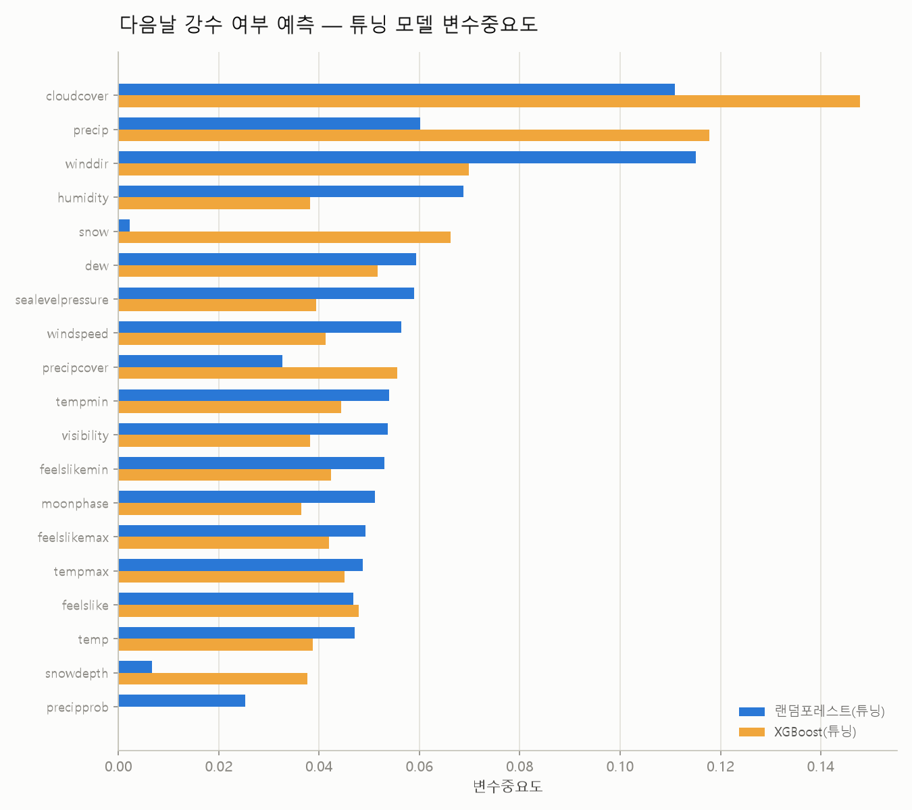
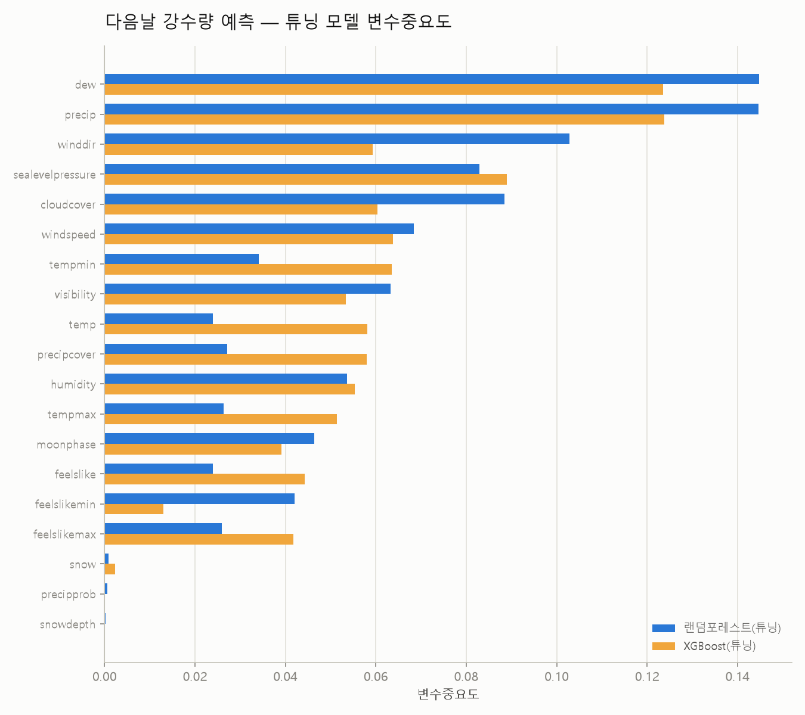
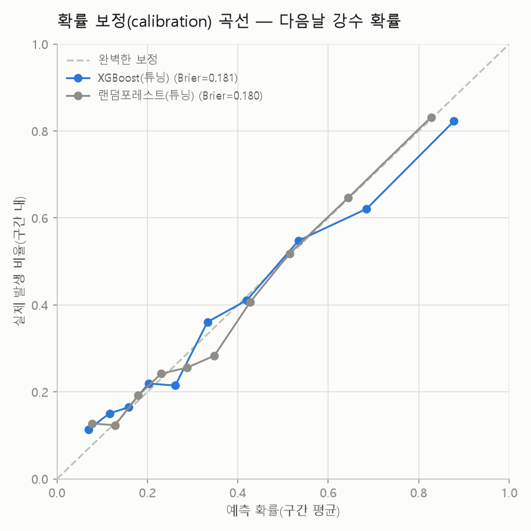
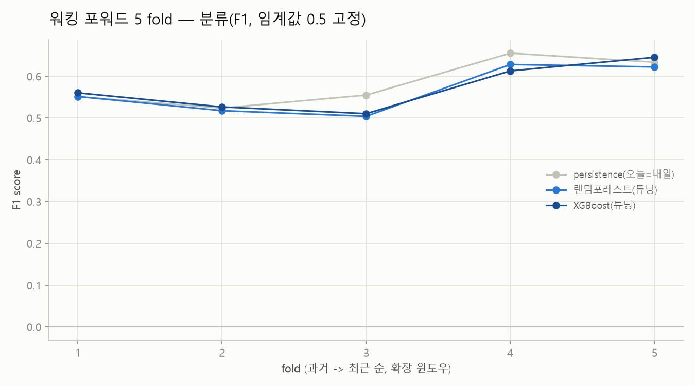
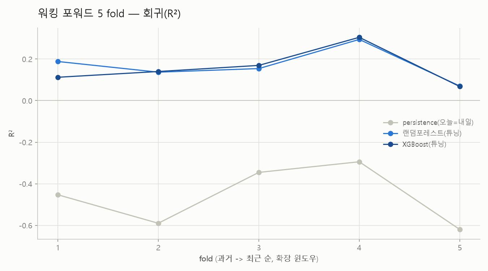
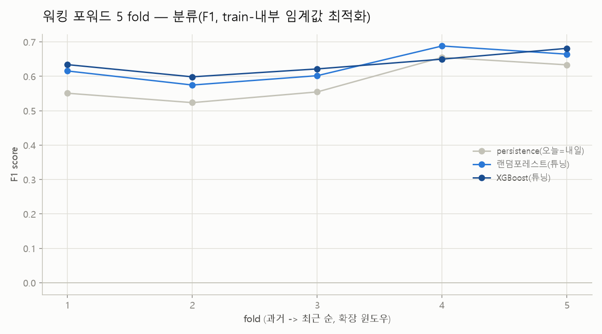

# 상세 분석 리포트: 서울 다음날 강수 예측

데이터: 서울 일별 기상 관측 1994-01-01 ~ 2024-01-01 (10,958행, 결측 없이 매일 기록)

> **정규 파이프라인(1\~9장) + 외부 피드백 반영(10장)까지 끝난 상태입니다.** 5장의 성능
> 수치는 무작위(random) 8:2 분할 기준이고, 8장(시간 누수 검증)·10.3(워킹 포워드 재검증)에서
> 시간순으로도 다시 확인했습니다. 결론이 장마다 조금씩 다르게 들릴 수 있어 아래에 최종
> 요약 3줄을 먼저 둡니다 — 각 줄이 가리키는 장에서 왜 그런지 확인하세요.

**최종 결론 3줄**
1. **분류(내일 비 옴)**: persistence 기준선을 이기지만(5장, 10.3), 임계값을 공정하게 고르지 않으면 오히려 진다는 걸 10.3에서 직접 보였다. 절대 성능은 낮다(recall 0.523, 5장).
2. **회귀(강수량)**: R²≈0.14\~0.15가 이 변수 구성의 사실상 천장이다(3·7장). 튜닝(19장)·대안 모델(Tweedie, 10.2)로도 못 넘었다.
3. **결합(분류×회귀)**: 무조건부 회귀보다 R²는 소폭 낫지만(9장), MedAE 기준으론 오히려 RF(튜닝) 단독이 더 낫다(9장) — "결합이 전반적으로 우월하다"가 아니라 "오차의 종류가 다르다"가 정확한 요약이다.

---

## 1. 무엇을 예측하는가

1. **내일 비가 올지** (분류, `rain_tomorrow`) — 오늘(t)까지의 날씨로 내일(t+1) 강수 여부를 맞춘다.
2. **온다면 얼마나 올지** (회귀, `precip_tomorrow`) — 내일 강수량(inch)을 맞춘다.
3. 1·2번을 곱한 기대 강수량 결합 (9장).

> `rain_tomorrow`는 `precipprob(다음날)==100`으로 정의된다(`04_build_next_day_target.py`).
> `precip`이 이 데이터에서 비·눈을 통칭하는 컬럼이라 **"비 또는 눈이 왔는지"**를 뜻하고
> "비만"이 아니다. 다만 서울 데이터에서 눈 오는 날 자체가 드물고(6장), 분류·회귀 모두
> `snow`/`snowdepth`의 변수중요도가 거의 0이라 실질적으로는 강수 발생 여부와 거의 같다.

입력은 항상 t시점까지의 값만 쓰고, t+1일자 값은 절대 입력에 넣지 않는다 (`04_build_next_day_target.py`에서 3개 지점 직접 대조로 누수 검증 완료).

## 2. 데이터 정리 과정에서 발견한 것

- 원본 CSV 15개 중 `seoul 2022-01-01 to 2024-01-01.csv` 한 파일만 미터법(섭씨/mm/kmh/km)으로 수집돼 있었다. 병합 전 `tempmax` 중앙값 기준으로 자동 감지해 다른 파일과 같은 단위계(°F/inch/mph/mile)로 변환했다 (`01_merge_seoul_weather.py`).
- `precipprob`는 이름과 달리 이 데이터에서 0 또는 100 두 값만 나타나는 사실상의 이진 플래그다 — 확률이 아니라 "강수 발생 여부"로 봐야 한다.

## 3. EDA 핵심 발견

| 확인한 것 | 결과 |
|---|---|
| 강수 발생 비율 | 다음날 비/눈 옴 36.3% — 한쪽으로 심하게 쏠리지 않음 |
| 계절성 | 7~8월 강수 비율 약 59%, 겨울 23~28% — 여름이 겨울의 2배 이상 |
| 요일 효과 | 계절 안에서는 요일별 차이 거의 없음 (날씨는 요일과 무관) |
| 강수 여부와 상관 큰 변수 | `cloudcover`(r=0.38), `precipprob`(0.33), `precipcover`(0.31), `humidity`(0.29) |
| 강수량과 상관 큰 변수 | 대체로 강수 여부보다 약함 — 오늘 `precip`(r=0.26)이 최대 |

**가장 중요한 시사점**: 강수 *여부*는 구름량·습도 등과 상관관계가 어느 정도(r=0.3\~0.4) 있지만, 강수 *양*은 어떤 입력 변수와도 상관관계가 약하다(r≤0.3). 이는 4~5장의 회귀 성능이 왜 낮은지를 미리 예고하는 결과다.

### 이 상관관계 조사는 일부 변수만 골라본 게 아니다

`10_feature_correlation_eda.py`는 숫자로 된 입력 후보 **19개 전부**(구름·습도·기온·기압·풍속·시정 등)를 전수 계산했다. 5개(`severerisk`, `windgust`, `uvindex`, `solarradiation`, `solarenergy`)만 계산에서 빠졌는데, 이는 상관관계를 보고 뺀 게 아니라 3단계 품질체크에서 **결측치 50% 이상**이라 애초에 입력 후보에서 제외했기 때문이다.

**왜 구름 관련 변수도 "양"과는 상관관계가 약할까.** `cloudcover`(하늘을 덮은 구름의 비율, %)는 강수 *여부*와는 관련이 있다(r=0.38) — 구름이 많을수록 비 올 가능성이 커지기 때문이다. 하지만 이 데이터는 **구름이 얼마나 두꺼운지, 어떤 종류인지(가랑비만 내리는 얇은 구름 vs 폭우를 쏟는 적란운), 대기 상층의 기압 배치나 전선 위치가 어떤지**는 담고 있지 않다 — 지상에서 하루 단위로 요약한 숫자뿐이다. "비가 올까"는 이 정도로도 어느 정도 짐작되지만, "얼마나 쏟아질까"는 원래 이런 요약 통계만으로는 짐작하기 어려운 정보다.

이게 단순히 "상관계수가 선형 관계만 잡아내서" 생기는 착시가 아니라는 것도 확인했다 — 비선형 관계까지 잡아내는 랜덤포레스트·XGBoost로 회귀를 돌려도(5장) 튜닝 후 R²가 0.14~0.15에 그쳤다. **즉 계산 방식의 한계가 아니라, 이 변수 구성 자체에 강수량을 설명할 정보가 부족한 것**이다. 같은 입력 변수로 다른 모델을 더 시도하거나 튜닝을 더 해도 이 한계를 크게 넘어서긴 어려울 것으로 본다.

### 방법론 노트 — 상관관계가 낮으면 모델링은 의미가 없나

**아니다.** 상관계수는 변수를 **하나씩 따로** 볼 때의 직선 관계만 잡아낸다. 여러 변수를 조합했을 때(또는 관계가 직선이 아니라 휘어져 있을 때) 낱개로는 안 보이던 신호가 나올 수 있어서, 상관관계가 낮다고 모델을 안 돌려보는 건 성급한 판단이다.

이 프로젝트가 그 증거다. 가장 강한 단일 변수는 오늘 `precip`(r=0.26) — 이것 하나로 설명되는 비율은 r² ≈ 0.068(약 7%)이다. 그런데 19개 변수를 **전부 조합**해 랜덤포레스트·XGBoost로 돌린 결과는 R² = 0.146 — 단일 변수 상관계수가 예고한 것의 **2배 이상**이었다. 조합 효과가 실제로 존재했다는 뜻이다.

**그래서 순서가 중요하다.**
1. 상관계수로 기대치를 낮게 잡는다 (완벽한 예측은 기대하지 않는다).
2. 그래도 비선형·다변수 조합이 가능한 모델은 **한 번은 돌려본다** — 낱개 상관관계가 못 잡아내는 조합 효과가 있을 수 있어서다.
3. 모델까지 돌렸는데도 여전히 상관관계가 예고한 수준에서 크게 벗어나지 못한다면(이 프로젝트처럼 R²=0.14~0.15), **그때 비로소 "이 변수 구성으로는 안 된다"고 확정할 수 있다.** 상관계수만 보고 미리 포기했다면 이 확정 자체를 할 수 없었을 것이다.

즉 "상관관계가 낮다 → 모델링 자체가 무의미하다"가 아니라, "상관관계가 낮다 → 모델링까지 해보고 나서 판단하되, 기대치는 낮게 잡는다 → 모델까지 낮게 나오면 그제서야 이 변수 구성의 한계로 결론짓는다"가 정확한 순서다.

## 4. 기준선 (베이스라인)

모델을 만들기 전에 "학습 없이도 나오는 점수"를 먼저 쟀다 (`12_baseline.py`).

| 분류 기준선 | accuracy | f1 |
|---|---|---|
| 다수 클래스만 예측 | 0.637 | **0.000** |
| persistence (오늘=내일) | 0.687 | 0.570 |

| 회귀 기준선 | RMSE | R² |
|---|---|---|
| 평균값 예측 | 0.723 | -0.0004 |
| persistence (오늘=내일) | 0.895 | **-0.530** |

두 기준선의 성격이 반대다. 분류는 "오늘 상태를 내일도 그대로 쓰는" persistence가 더 낫고(강수는 며칠씩 이어지는 경향), 회귀는 반대로 persistence가 평균값 찍기보다 훨씬 나쁘다(양은 그날그날 크게 흔들려서 베끼면 오히려 크게 틀림). **accuracy·RMSE만 보고 판단하면 안 되는 이유**가 여기서 나온다 — 다수 클래스 기준선은 accuracy 0.637로 꽤 높아 보이지만 f1=0으로 완전히 무용지물이다.

## 5. 모델 비교

`13~18` 스크립트로 기본 모델 6종을, `19_hyperparameter_tuning.py`로 RF·XGB 튜닝 모델 4종을 추가했다. `20_model_comparison_chart.py`가 전체를 한 표·차트로 정리했다.

| 분류 모델 | accuracy | f1 |
|---|---|---|
| XGBoost (튜닝) | 0.740 | **0.593** |
| XGBoost | 0.728 | 0.587 |
| 랜덤포레스트 (튜닝) | 0.735 | 0.573 |
| persistence 기준선 | 0.687 | 0.570 |
| 랜덤포레스트 | 0.731 | 0.567 |
| 로지스틱회귀 | 0.726 | 0.564 |
| 다수 클래스 기준선 | 0.637 | 0.000 |

모든 모델이 f1 기준으로 persistence 기준선을 넘거나 비슷한 수준이다. 튜닝 효과는 있지만 크지 않고(XGBoost f1 0.587→0.593), 모델 간 순위 역전도 없다. (분류에 쓴 임계값은 튜닝 없이 sklearn/XGBoost 기본값인 0.5를 그대로 썼다 — `predict()`만 호출했고 test로 임계값을 따로 탐색한 적은 없다. 다만 이 "모델이 기준선을 이긴다"는 결론이 무작위 분할에서만 근소하게 성립한다는 게 10장 워킹 포워드 재검증에서 드러난다 — 시간순으로 여러 번 나눠 보면 오히려 persistence가 이긴다.)

> **F1=0.593이 "좋은 성능"이라는 뜻은 아니다.** 튜닝된 XGBoost를 정밀도·재현율로 뜯어보면
> **precision 0.684 / recall 0.523**이다. 이건 "내일 비 온다"고 예측한 것 중 68%만 맞고,
> **실제로 비 온 날의 47%는 놓친다**는 뜻이다. 매일 우산 여부를 이 모델에만 의존한다면 비
> 오는 날 둘 중 하나 꼴로 잘못된 안내를 받는 셈이라, 실전에 바로 쓰기엔 불안한 수준이다.
> 여기서 "쓸만하다"의 의미는 절대 성능이 아니라 **상대 비교**다 — "매일 안 온다고만 찍는"
> 기준선(f1=0, 완전 무용지물)보다는 실제 신호를 학습했고, persistence 기준선(f1=0.570)도
> 소폭 넘었다는 뜻일 뿐, "정확히 잘 맞히는 모델"이라는 뜻이 아니다.

| 회귀 모델 | RMSE | R² |
|---|---|---|
| 랜덤포레스트 (튜닝) | 0.668 | **0.146** |
| XGBoost (튜닝) | 0.669 | 0.143 |
| 선형회귀 | 0.686 | 0.100 |
| 랜덤포레스트 | 0.687 | 0.099 |
| 평균값 기준선 | 0.723 | -0.0004 |
| XGBoost (튜닝 전) | 0.730 | -0.020 |
| persistence 기준선 | 0.895 | -0.530 |

**튜닝 전 XGBoost는 R²=-0.020으로 평균값 찍기보다 나빴다.** 원인을 진단해보니 train R²=0.996(연습문제를 거의 암기) vs test R²=-0.020(새 문제는 완전히 틀림)으로, 기본 하이퍼파라미터(규제 없음, `learning_rate`≈0.3)가 이 데이터 규모(8,765행, 대부분 0에 몰린 분포)엔 과했던 전형적인 과적합이었다. `learning_rate`를 낮추고 `max_depth`를 얕게 규제한 뒤 R²=0.143으로 회복됐다.

**다만 튜닝 후에도 R²는 0.14~0.15 수준으로 낮다.** 이는 튜닝 부족이 아니라 3장 EDA에서 이미 예고된 결과다 — 어떤 입력 변수도 내일 강수량과 강한 상관관계(r>0.4)를 갖지 않는다. **강수량은 이 정도 입력 변수만으로는 정확히 맞히기 어려운 문제**라는 것이 이번 분석의 정직한 결론이다. "회귀 모델이 잘못 만들어졌다"가 아니라 "이 문제 자체가 원래 어렵다"로 해석해야 한다.

## 6. 변수중요도

튜닝된 모델 4개의 변수중요도를 비교했다 (`21_feature_importance_chart.py`).

- 분류: `cloudcover`가 RF·XGB 둘 다 최상위(0.111 / 0.148).
- **`precipprob`는 XGBoost에서 중요도 0.000** — `precip`과 정보가 겹쳐서(둘 다 "오늘 비 왔는지" 신호) 트리가 `precip` 하나로 대체한 것으로 보인다. 로지스틱회귀는 계수가 남아 있어 대비된다.

- 회귀: `dew`·`precip`이 RF·XGB 둘 다 최상위권(약 0.12~0.14).
- 분류·회귀 모두 `snow`, `snowdepth`, `precipprob`은 중요도가 거의 0 — 서울 데이터 특성상 눈 오는 날 자체가 드물어 신호가 약하다.

> **주의**: 변수중요도는 "상관관계"도 "원인"도 아니다. 트리 모델의 중요도는 분할 방식·변수
> 스케일 등 알고리즘 내부 편향에 영향을 받고, `precipprob`처럼 다른 변수(`precip`)와 정보가
> 겹치면 중요도가 한쪽으로 쏠려 0에 가깝게 나올 수 있다(위 XGBoost `precipprob` 사례가 그
> 예). "이 변수가 중요하다/안 중요하다"를 인과적 설명으로 바로 확장하지 않도록 주의했다.

## 7. 현재까지의 결론

- **강수 여부 예측(분류)은 기준선을 이기지만, 절대 성능은 낮다.** 무작위 분할(5장, f1 0.570→0.593)과 워킹 포워드 재검증(10.3, 임계값을 train 내부에서 공정하게 고르면 f1 0.584→0.637) 둘 다에서 모델이 persistence를 이겼다는 게 최종 결론이다. 다만 **10.3에서 임계값을 기존처럼 0.5로 고정했을 때는 오히려 persistence가 이겼다** — 이 프로젝트는 그 과정 자체를 남겨, "임계값 선택이 결론을 뒤집을 수 있다"는 걸 직접 보여준 사례다. 절대 성능은 여전히 낮다 — 재현율 0.523(5장)이 뜻하듯 **실제 비 온 날의 상당수를 놓친다.** "실전에 바로 쓸 만한 모델"이라고 하면 과장이다.
- **강수량 예측(회귀)은 한계가 뚜렷하고, 이 한계는 튜닝으로 해결되지 않는다.** 튜닝으로 치명적 과적합(R²=-0.02)은 고쳤지만, R²=0.14~0.15가 사실상의 천장으로 보인다. 원인은 모델 설계가 아니라 **이 데이터의 변수 구성 자체가 강수량을 설명할 정보를 충분히 담고 있지 않기 때문**이다(3장) — 구름 비율은 있어도 구름 두께·종류, 상층 기압계 같은 정보가 없다. 같은 입력으로 다른 알고리즘을 더 시도하거나 그리드를 더 넓혀도 이 천장을 크게 넘기긴 어려울 것으로 판단한다. 성능을 더 올리려면 **입력 변수 자체를 바꿔야 한다**(예: 레이더/위성 자료, 상층 기압 자료 추가) — 이 데이터셋 안에서는 추가 실험의 기대 이익이 낮다.
- 이 결과가 3단계(기대 강수량 결합, 9장)에서 실제로 확인됐다: 결합 방식(R²=0.154)이 무조건부 회귀(R²=0.146)보다 근소하게 낫지만, "확률"(1번)의 재현율 문제와 "양"(2번)의 낮은 천장이 결합값에도 그대로 이어진다. 결합에 쓰인 확률이 실제로 보정돼 있는지(10.1), 0이 많은 타깃 전용 모델(Tweedie)을 더 붙여봐도 이 천장을 넘는지(10.2)는 10장에서 별도로 검증했다 — 결론은 바뀌지 않았다.

## 8. 시간 누수 검증

`22_time_leakage_evaluation.py`로 지금까지 쓴 무작위 8:2 분할이 washington 자전거 대여량 프로젝트처럼 성능을 부풀렸는지 확인했다. **결론부터: 이 프로젝트는 그렇지 않았다** — 오히려 날짜순 분할에서 성능이 비슷하거나 더 높게 나왔다.

### 방법

두 가지 분할을 비교했다.
- **무작위 분할** (지금까지 써온 것): `11_train_test_split.py`가 만든 train 8,765 / test 2,192
- **날짜순 분할** (새로 추가): 1994-01-01~2017-12-30(24년, train 8,765) → 2017-12-31~2023-12-31(6년, test 2,192)

각 분할에서 학습 없이 계산되는 기준선 두 개와, 튜닝된 모델(19단계 best_params 재사용, 재탐색 없음)을 같이 비교했다.

| 분류(F1) | 무작위 분할 | 날짜순 분할 |
|---|---|---|
| neighbor-copy(train에서 가장 가까운 날짜 베끼기) | 0.553 | 0.584 \* |
| persistence(오늘=내일) | 0.570 | 0.643 |
| 랜덤포레스트(튜닝) | 0.573 | 0.608 |
| XGBoost(튜닝) | 0.593 | 0.632 |

| 회귀(R²) | 무작위 분할 | 날짜순 분할 |
|---|---|---|
| neighbor-copy(train) | -0.520 | -0.050 \* |
| persistence(오늘=내일) | -0.530 | -0.524 |
| 랜덤포레스트(튜닝) | 0.146 | 0.143 |
| XGBoost(튜닝) | 0.143 | 0.150 |

\* **`neighbor-copy(train)`의 날짜순 분할 수치는 왜곡돼 있어 그대로 믿으면 안 된다.** 날짜순으로 나누면 test는 전부 train보다 미래라서, "가장 가까운 train 날짜"가 test 2,192일 전체에 대해 **train의 마지막 하루로 고정**된다(평균 간격 1,096일=3년). 즉 "이웃을 베끼는" 게 아니라 3년 전 하루의 값을 3년 내내 복붙한 것과 같다. 그 하루가 우연히 "비 옴"이었어서 recall=1.0(전부 비 온다고 찍음)으로 f1이 그럴듯하게 나온 것뿐이다. **`persistence(오늘=내일)`가 분할과 무관하게 항상 정직하게 계산되는 진짜 비교 기준**이다.

### 왜 washington과 반대 결과가 나왔나

**모델 성능만 오른 게 아니라, train을 전혀 쓰지 않는 `persistence` 기준선도 똑같이 올랐다**(f1 0.570→0.643, 분류). 모델이 시간 누수로 부풀려졌다면 학습을 안 하는 persistence는 그대로여야 하는데 같이 올랐다는 건, **분할 방식이 아니라 테스트 기간 자체(2018~2023년)의 날씨가 우연히 더 예측하기 쉬운 특성(계절 패턴이 더 뚜렷했거나 이상치가 적었거나)을 가졌다는 뜻**이다.

washington(자전거 대여량)과 이 프로젝트의 근본적인 차이는 **타깃의 날짜 간 연속성**이다.
- 자전거 대여량: 오늘 대여량과 내일 대여량이 매우 비슷함(강한 자기상관) → 무작위 분할에서 이웃 날이 학습에 섞이면 답을 거의 그대로 베낄 수 있어 크게 부풀려짐(neighbor-copy R² 0.717)
- 강수: 오늘 비가 왔다고 내일도 비슷하게 온다는 보장이 약함(비는 왔다 안 왔다 들쭉날쭉) → 무작위 분할의 neighbor-copy도 f1=0.553으로 이미 약해서, 애초에 "베낄 만한 답"이 많지 않았다

### 결론

- 이 프로젝트의 무작위 분할 성능은 **washington 사례처럼 시간 누수로 부풀려진 게 아니다.** 강수는 자전거 대여량만큼 날짜 간 자기상관이 강하지 않아 애초에 "이웃 날 베끼기"로 얻을 게 적었다.
- 따라서 5\~6장의 성능 수치(F1 0.593, R² 0.143\~0.146)를 **정직한 성능으로 인용해도 된다.** 문서 상단의 "무작위 분할이라 부풀려졌을 수 있다"는 경고는 이 검증으로 해소됐다.
- 다만 날짜순 분할이 오히려 소폭 더 좋게 나온 것 자체를 "모델이 미래를 더 잘 맞힌다"로 해석하면 안 된다 — persistence 기준선도 같이 올랐으므로 **테스트 기간(2018\~2023)이 우연히 더 예측하기 쉬웠다**는 뜻에 가깝다.

## 9. 기대 강수량 (분류×회귀 결합)

problem-definition.md 가설 3: "확률(1번) × 조건부 강수량(2번)"을 곱한 기대값이 지금까지의 (비 안 오는 날도 포함해 통째로 학습한) 무조건부 회귀보다 나은지 확인했다 (`23_combined_expected_precip.py`).

지금까지의 회귀(16\~19단계)는 비 안 오는 날(`precip_tomorrow`=0)까지 포함한 전체 데이터로 학습했다. 여기서는 **비 오는 날(`rain_tomorrow`=1)만 3,180행 뽑아 조건부 회귀**를 새로 학습하고, 19단계 튜닝된 분류기의 확률과 곱했다.

| 방식 | RMSE | MedAE | R² |
|---|---|---|---|
| **기대 강수량(결합, 조건부 XGB)** | **0.665** | 0.073 | **0.154** |
| 랜덤포레스트(튜닝, 무조건부) | 0.668 | **0.067** | 0.146 |
| XGBoost(튜닝, 무조건부) | 0.669 | 0.080 | 0.143 |
| 선형회귀 | 0.686 | — | 0.100 |
| 랜덤포레스트 | 0.687 | — | 0.099 |
| XGBoost(튜닝 전) | 0.730 | — | -0.020 |

**결합 방식이 지금까지 중 가장 나은 R²(0.154)를 냈다.** 다만 튜닝된 무조건부 모델(0.143\~0.146)과의 차이는 0.01 수준으로 크지 않다 — "결합이 확실히 더 낫다"기보다는 "비슷한 수준에서 소폭 개선"으로 해석하는 게 정확하다. 이는 7\~8장에서 이미 확인한 "이 변수 구성 자체의 정보 천장(R²≈0.14\~0.15)"과 일치하는 결과로, 결합 기법을 바꿔도 이 천장 자체를 크게 넘어서긴 어렵다는 걸 다시 한번 보여준다.

**MedAE(중앙값 절대오차)로 보면 순위가 뒤집힌다** — 랜덤포레스트(튜닝, 무조건부)가 0.067로 결합(0.073)보다 오히려 낮다(더 좋다). RMSE/R²는 큰 오차(폭우 등 드문 큰 값)에 민감해 결합이 유리하게 나오지만, "전형적인 하루"의 오차만 보면 무조건부 RF가 더 촘촘하다. 즉 **결합의 R² 개선은 평범한 날의 정확도가 아니라 드문 큰 값을 상대적으로 덜 틀리는 데서 온다** — "결합이 전반적으로 더 낫다"가 아니라 "결합과 RF(튜닝)는 서로 다른 종류의 오차에서 강점이 갈린다"로 해석하는 게 더 정확하다.

참고로 조건부 회귀 자체만 놓고 보면(테스트의 비 오는 날 795행 한정) R²=0.108, MedAE=0.278로, "비가 온다는 걸 이미 아는 상태에서 양을 맞히는 것"조차 쉽지 않다 — 강수량의 변동성 자체가 크다는 3장의 결론과 다시 맞닿는다.

## 10. 피드백 반영 — 확률 보정 · Tweedie 비교 · 워킹 포워드 재검증

외부 검토에서 나온 세 가지 지적(캘리브레이션 전제, 0이 많은 타깃에 대한 대안 모델, 단일 split의 한계)을 각각 확인했다.

### 10.1 확률 보정 — 9장의 곱셈 전제는 타당한가

9장(기대 강수량 결합)은 분류 확률을 그대로 조건부 회귀값에 곱한다. 트리 모델의 `predict_proba`가 실제 확률처럼 보정돼 있지 않다면 이 곱셈이 왜곡될 수 있어, Brier score와 reliability diagram으로 확인했다(`24_probability_calibration.py`).

| 모델 | Brier score | 기저 비율만 예측(비교 기준) |
|---|---|---|
| XGBoost(튜닝) | **0.1805** | 0.2311 |
| 랜덤포레스트(튜닝) | **0.1801** | 0.2311 |

두 모델 다 "항상 기저 비율(36.3%)만 찍는" 것보다 뚜렷이 나은 Brier score를 냈고, reliability diagram도 대각선(완벽한 보정)에서 크게 벗어나지 않는다. **별도의 확률 보정(Platt/isotonic) 없이 9장의 곱셈을 그대로 써도 되는 수준**으로 판단한다.

### 10.2 0이 많은 타깃에 맞춘 대안 모델 — Tweedie 회귀

9장의 결합(분류×조건부 회귀) 외에, scikit-learn이 "0이 많고 나머지는 오른쪽으로 긴 연속값" 분포에 직접 대응하는 `TweedieRegressor`(power 1.1/1.5/1.9)를 별도로 붙여 비교했다(`25_tweedie_regression_precip.py`).

| 방식 | RMSE | MedAE | R² |
|---|---|---|---|
| 기대 강수량(결합, 조건부 XGB) | 0.665 | 0.073 | **0.154** |
| 랜덤포레스트(튜닝) | 0.668 | **0.067** | 0.146 |
| XGBoost(튜닝) | 0.669 | 0.080 | 0.143 |
| Tweedie(power=1.9) | 0.684 | 0.090 | 0.105 |
| 선형회귀 | 0.686 | — | 0.100 |
| 랜덤포레스트 | 0.687 | — | 0.099 |
| Tweedie(power=1.5) | 0.688 | 0.104 | 0.094 |
| Tweedie(power=1.1) | 0.693 | 0.131 | 0.083 |

Tweedie는 선형회귀보단 나았지만(R² 0.083~0.105 vs 0.100 — power에 따라 선형회귀와 비슷하거나 소폭 낮음), 트리 기반 모델(0.143~0.146)이나 9장의 결합(0.154)은 넘지 못했다. **분포 형태에 맞춘 전용 모델을 하나 붙여봐도 R²≈0.15 근방의 천장을 넘지 못했다** — 7장에서 "이 변수 구성 자체의 정보 한계"로 내린 결론이 대안 모델 실험으로도 반증되지 않고 오히려 보강됐다.

### 10.3 워킹 포워드(확장 윈도우) 재검증 — 그리고 임계값의 함정

8장의 시간순 검증은 split이 1번뿐이라 특정 연도의 기후 패턴에 결과가 좌우됐을 수 있다는 지적을 받아, 확장 윈도우 방식으로 5회 반복했다(`26_rolling_window_evaluation.py`). 각 fold는 이전 모든 과거를 train으로, 그 다음 약 3년을 test로 쓴다(1994년부터 시작해 test 구간이 2009→2023년까지 순차 이동). **재탐색은 하지 않는다** — 19단계에서 찾은 하이퍼파라미터를 5개 fold 전부에 그대로 재사용하고 fold마다 재학습만 한다(8장 22단계와 동일한 방침).

| 분류(F1, 임계값 0.5 고정) | fold 평균 | 표준편차 |
|---|---|---|
| **persistence(오늘=내일)** | **0.584** | 0.057 |
| 랜덤포레스트(튜닝) | 0.565 | 0.058 |
| XGBoost(튜닝) | 0.571 | 0.057 |

| 회귀(R²) | fold 평균 | 표준편차 |
|---|---|---|
| persistence(오늘=내일) | -0.460 | 0.144 |
| 랜덤포레스트(튜닝) | 0.169 | 0.082 |
| XGBoost(튜닝) | **0.159** | 0.090 |

**회귀는 8장의 결론이 그대로 유지된다** — 모델(R²≈0.16)이 persistence(-0.46)를 fold 전체에서 안정적으로 이긴다.

**분류는 언뜻 8장·5장의 결론이 뒤집힌 것처럼 보인다.** 무작위 분할(5장, XGB f1=0.593 > persistence 0.570)에서는 모델이 근소하게 이겼지만, 5개 fold 평균(임계값 0.5 고정)으로 보면 persistence(0.584)가 XGBoost(0.571)·RF(0.565)보다 오히려 높다. 다만 **차이(0.013)가 fold 간 표준편차(약 0.057)보다 훨씬 작다** — fold 5개짜리 비교로는 이 차이가 우연 범위 안인지, 진짜 패턴인지 그 자체로는 확신하기 어렵다.

**그래서 원인을 한 겹 더 파봤다: F1은 분류 임계값에 민감한데, 지금까지 모든 분류(13~19단계)는 `predict()`의 기본값인 0.5를 그대로 썼다.** "persistence가 이긴다"는 위 결과가 이 고정 임계값 때문일 수 있어, 각 fold의 train을 다시 날짜순 85:15로 나눠(뒤 15%는 train 안의 미래일 뿐 test는 절대 아님) **test를 전혀 보지 않고** F1이 최대가 되는 임계값을 찾은 뒤 그 임계값을 test 예측에 적용했다.

| 분류(F1, train-내부 임계값 최적화) | fold 평균 | 표준편차 | 참고: 고른 임계값 범위 |
|---|---|---|---|
| persistence(오늘=내일, 임계값 개념 없음) | 0.584 | 0.057 | — |
| 랜덤포레스트(튜닝) | 0.629 | 0.046 | 0.25\~0.30 |
| **XGBoost(튜닝)** | **0.637** | **0.031** | 0.25\~0.35 |

**결과가 다시 뒤집힌다.** 임계값을 0.5로 고정해서 생긴 착시였다 — 5개 fold 모두 최적 임계값이 0.25\~0.35 구간(0.5보다 낮음)에 몰려 있었는데, 이는 강수(36.3%)가 다수 클래스가 아니라서 0.5보다 낮은 쪽에서 recall과 precision의 균형점이 생기기 때문이다. train 내부에서만 고른 임계값을 test에 적용하니 XGBoost가 f1=0.637(±0.031)로 persistence(0.584±0.057)를 **확실한 차이로, 그리고 훨씬 낮은 변동성으로** 이겼다 — fold별 최적 임계값도 0.25~0.35로 안정적이어서 "우연히 맞은 값"이 아니라 데이터 자체의 클래스 불균형이 만든 구조적 패턴으로 보인다.

**해석**: 임계값 0.5 고정은 사실상 "다수 클래스 방향으로 편향된 결정 규칙"을 강제한 것이었다. 5장에서 F1=0.593으로 보고한 무작위 분할 성능도 같은 0.5 고정값 기준이라, **임계값을 최적화하면 5장의 절대 성능(F1)도 이보다 높게 나올 가능성이 크다**(이 프로젝트에서 무작위 분할로는 별도 확인하지 않았다 — 시간순 5-fold 결과로 결론을 대신한다).

**7장 결론 재수정**: 10.3 초반의 "persistence가 이겼다"는 관찰은 최종 결론이 아니라 **중간 발견**이었다 — 원인을 추적한 결과 고정 임계값의 인공물이었음이 드러났다. **최종 결론은 "임계값을 공정하게(train 내부에서만) 고르면 분류 모델이 persistence 기준선을 fold 전반에서 안정적으로 이긴다"**이다. 다만 절대 성능(F1 0.64 근방, 5장의 recall 0.523 문제)이 낮다는 7장의 다른 결론은 그대로 유효하다.

## 11. 남은 작업

- [x] pipe-line.md 12단계: 시간순 분할로 재평가 — 완료, 시간 누수로 인한 성능 부풀림 없음을 확인
- [x] 3단계(기대 강수량 결합) 스크립트 — 완료, 무조건부 회귀 대비 소폭 개선(R² 0.146→0.154)
- [x] 남은 빈 문서(`CLAUDE.md`, `README.md`, `LICENSE`, `requirements.txt`) 채우기 — 완료
- [x] 외부 피드백 1차: 확률 보정(Brier score), Tweedie 비교, 워킹 포워드 재검증 — 완료 (10장)
- [x] 외부 피드백 2차: fold train-내부 임계값 최적화, MedAE 추가 — 완료 (10.3, 9장). **임계값 0.5 고정이 "persistence가 이긴다"는 착시를 만들었고, 공정하게 고르면 모델이 확실히 이긴다**는 게 최종 결론(10.3) — 7장 반영 완료.
